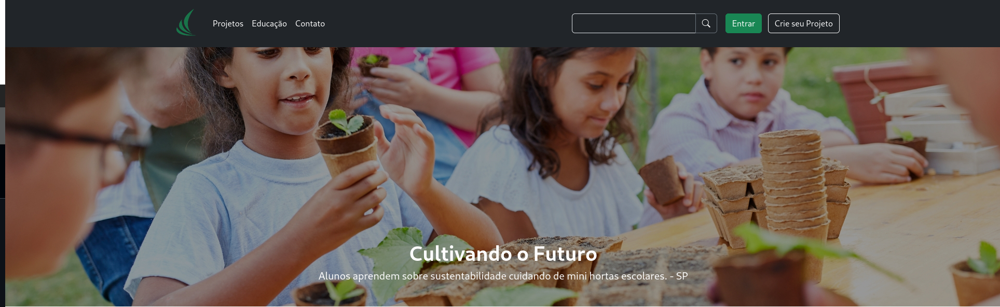
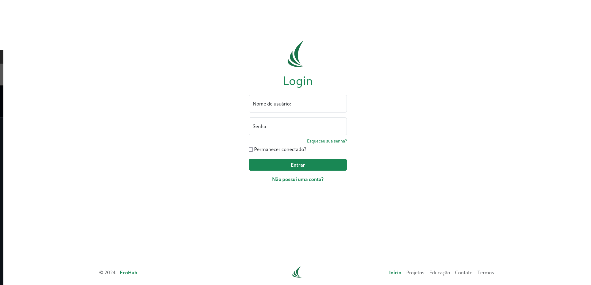
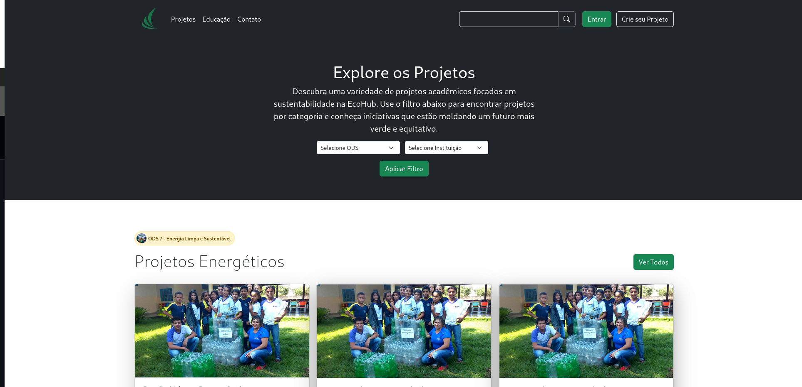
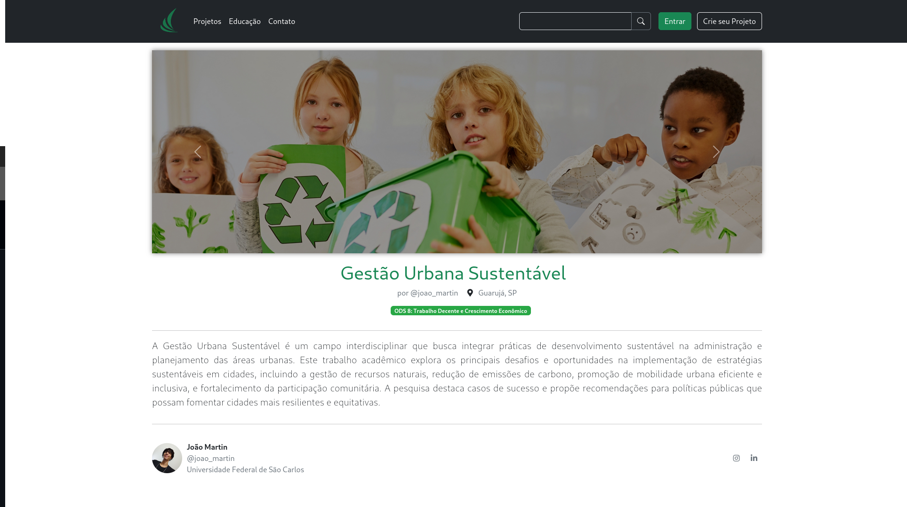
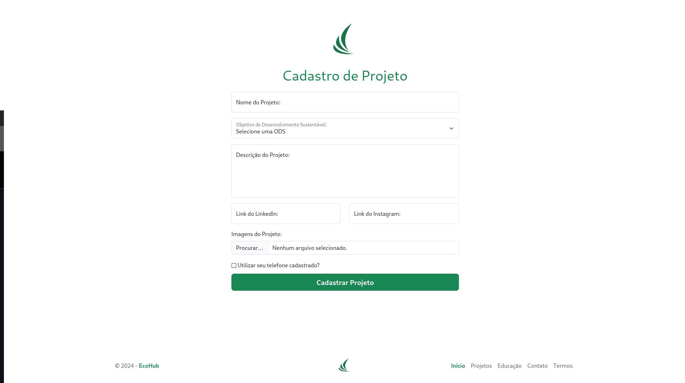
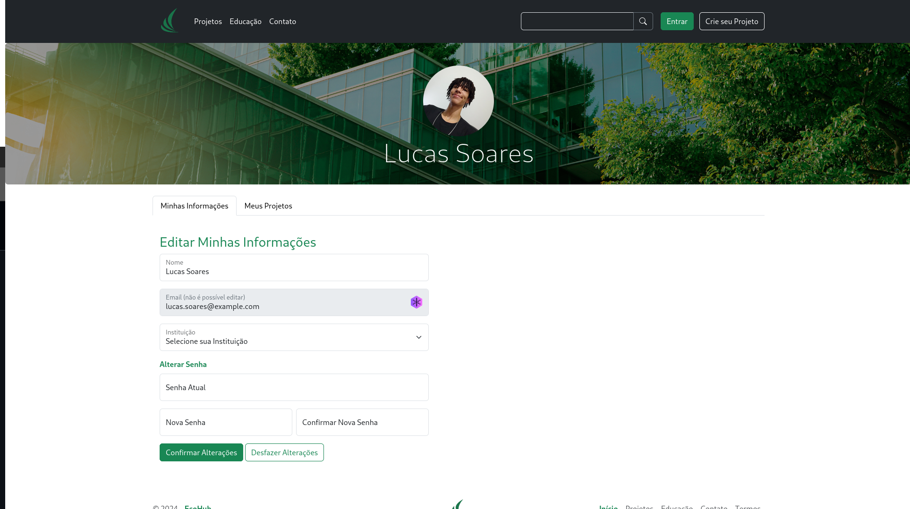

# EcoHub - Conectando Soluções a Investidores

**EcoHub** é uma plataforma online que conecta projetos acadêmicos voltados para sustentabilidade a investidores, proporcionando visibilidade e apoio para ideias inovadoras. Desenvolvido como parte do curso de Sistemas de Informação, o projeto busca transformar ideias esquecidas em oportunidades de crescimento.

🔗 **Repositório GitHub:** [EcoHub no GitHub](https://github.com/marcosguisleri/EcoHub)  
🌐 **Acesse o Site:** [EcoHub Online](https://eco-hub-sepia.vercel.app/)

---

## 🌍 Objetivo do Projeto

A EcoHub visa:
- Fornecer um espaço onde estudantes possam compartilhar projetos acadêmicos focados em sustentabilidade.
- Aumentar a visibilidade de soluções criativas e inovadoras.
- Atrair investidores e patrocinadores que desejam apoiar iniciativas sustentáveis.
- Criar uma comunidade de mentes criativas e colaborativas.

A ideia surgiu porque muitos projetos acadêmicos acabam esquecidos ou descartados sem nunca terem a oportunidade de se tornarem algo maior. A EcoHub busca mudar isso, criando uma ponte entre os criadores e potenciais investidores.

---

## 🚧 Status do Projeto

- **Front-end concluído.**  

Atualmente, o site apresenta a interface principal, com diversas páginas prontas. A expectativa é finalizar o back-end futuramente e lançar a versão completa. 

---

## 🛠 Tecnologias Utilizadas

- **HTML** - Estrutura e semântica das páginas.
- **CSS/Tailwind CSS** - Estilização responsiva e moderna.
- **JavaScript** - Interatividade das páginas.
- **Vercel** - Hospedagem do site.

---

## 📸 Capturas de Tela

  

---

  

---

  

---

  

---

  

---

  

---

  

---

## 📥 Como Rodar o Projeto Localmente

1. **Clone o repositório:**  
```bash
git clone https://github.com/marcosguisleri/EcoHub.git
```

2. **Acesse a pasta do projeto:**  
```bash
cd EcoHub
```

3. **Abra o arquivo HTML no navegador.**

---

## 📈 Futuro do Projeto

Planejo retomar o desenvolvimento do back-end em um futuro próximo. Caso tenha interesse em contribuir ou sugerir melhorias, fique à vontade para enviar uma mensagem ou fazer um pull request no repositório.

---

## 📅 Licença

Este projeto é de uso acadêmico e não possui licença específica para redistribuição. Para usos comerciais ou colaboração, entre em contato.

